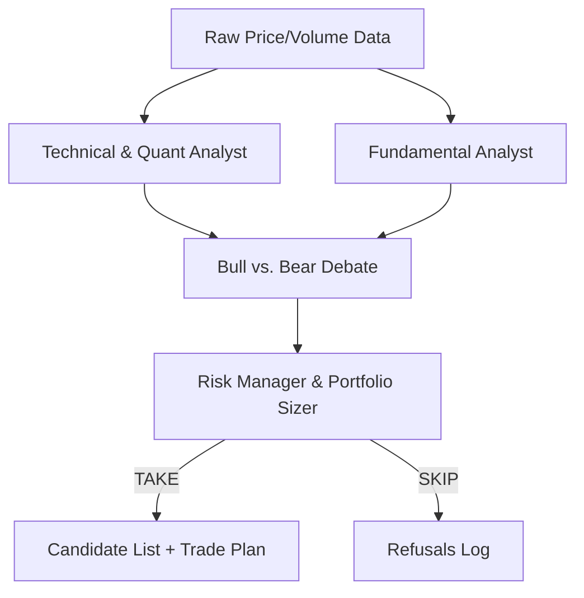

# AI Agentic Workflow Design & Decision Log

This document records the architectural decisions, design patterns, and concepts incorporated into the Manas OS Candidate Scanner, replacing deterministic math filters with an autonomous LLM agent debate workflow.

---

## 1. Architectural Concepts & Inspiration

The design draws inspiration from cutting-edge agentic trading and financial research systems (excluding live trade execution):

*   **TauricResearch/TradingAgents**: Collaborative, role-based agent simulation. We model this by separating analysis into Technical, Fundamental, and Risk perspectives.
*   **HKUDS/Vibe-Trading**: Swarm-based worker teams producing structured, evidence-backed reports.
*   **conceptworksx/Artha-Analytics**: Explainable strategies formed via debate (challenging bullish biases).
*   **HimanshuMohanty-Git24/RakshaQuant**: Strict risk rules and sizing constraints guiding LLM decision outputs.

---

## 2. Multi-Agent Debate Workflow (In-Prompt Swarm)

To ensure high performance, low latency, and zero rate-limiting issues, the multi-agent orchestration is executed as a **structured chain-of-thought** inside a single high-quality LLM call (e.g., DeepSeek V4):

### Role Breakdown
1.  **Technical & Quant Analyst**: Scans the trailing 20 daily price bars, checking EMAs (10, 21, 50), Stage (specifically Stage 2 uptrends vs. Stage 3 topping distribution), and relative strength.
2.  **Fundamental Analyst**: Checks quarterly sales growth, EPS QoQ/YoY, operating margin (OPM), and market capitalization.
3.  **Bull vs. Bear Debate**: Synthesizes a side-by-side comparison of the bullish catalyst against potential bear traps (overhead supply, market regime, exit conflict).
4.  **Risk Manager & Portfolio Sizer**: Performs the final discretionary judgment. If `TAKE`, calculates entry, stop-loss, target (measured move), and suggested quantity based on risk capital. If `SKIP`, logs the failed gate and reason to database `refusals`.

---

## 3. Database & Fallback Safety

*   **Graceful Fallback**: If the OpenRouter client encounters a network issue, missing API key, or invalid JSON, it logs a warning and instantly falls back to the original deterministic scan (`scan_candidates_deterministic`). The EOD pipeline is fully protected.
*   **WAL & Busy Timeout**: Added `PRAGMA busy_timeout = 30000` to prevent SQLite connection locks (`database is locked`) when running indicators/scans concurrently alongside the Vite API server.

---

## 4. Frontend Implementation

Surfaced directly on the Setups page candidate cards when in **Beginner Mode** (`!expert`):

*   Renders a side-by-side **Agent Analyst Debate** panel.
*   Shows the exact **Bull Case** (🟢) and **Bear Case** (🔴) to teach risk discipline and objective trading logic.
*   Displays Technical/Fundamental summaries at the card footer.
