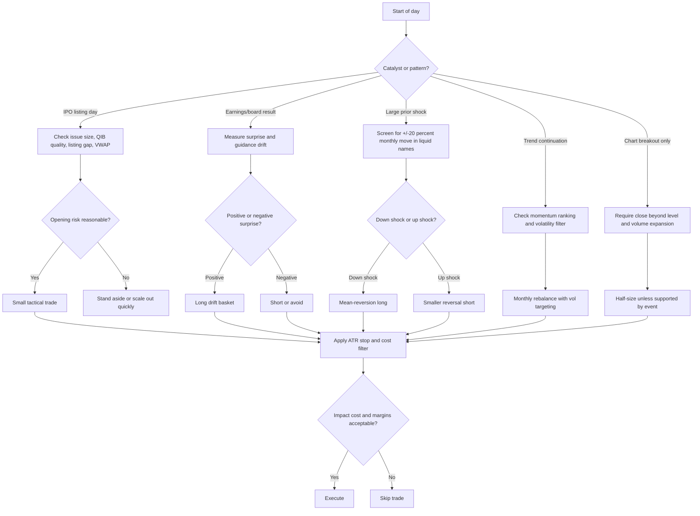

# Trading Setups and Strategies in Indian Markets

## Executive Summary

The strongest India-specific evidence in the material reviewed does **not** come from discretionary chart patterns alone. It comes from three reproducible families of setups: **earnings-related underreaction**, **medium-horizon mean reversion after very large prior moves**, and **momentum/trend continuation with explicit risk management**. In Indian equities, a long-short post-earnings-announcement drift strategy built on standardized unexpected earnings produced about **6% spread return over 64 days** in a Nifty 500 sample from 2002–2017 and remained significant after controlling for beta, size, value, illiquidity, and idiosyncratic volatility. Large one-month losers in liquid Indian stocks also showed strong reversals: after a **-20% monthly shock**, cumulative abnormal returns reached **11.61% over six months**, with positive follow-through in about **64%–66%** of cases and an estimated **~40% annualized economic profit** for the decline-reversal variant. On the continuation side, a monthly rebalanced top-decile momentum portfolio in the NIFTY100 outperformed the index by **10.7 percentage points per year**, while later Indian work found that **risk-managed momentum roughly doubled adjusted Sharpe** versus plain relative momentum. citeturn12view0turn17view0turn25view0turn16view2turn16view3

The evidence is **weaker and more practitioner-driven** for **IPO basis trades**, **high-ADR breakout/reversal trades**, and **flag/pennant continuation patterns**. India clearly offers real examples of these setups working or failing—Tata Technologies debuted at a **140% premium**, Hyundai Motor India opened **below issue price**, and recent technical breakouts such as Allied Blenders, Deepak Nitrite, MCX, and Bank of Maharashtra were explicitly framed by Indian financial media as flag or pennant continuations—but I did **not** find a robust India-wide peer-reviewed backtest for ADR breakout rules or flag/pennant rules with full trade-level statistics over the last five to ten years. Those setups are therefore best treated as **execution templates**, not as statistically settled anomalies. citeturn40search2turn40search3turn30search0turn30search1turn30search4turn30search5

For live trading in India, the practical edge often depends less on the entry signal than on **universe construction, liquidity filters, and costs**. NSE itself defines **impact cost** as a realistic execution-cost proxy and publishes liquidity statistics for indices and equities. Equity cash trading now also sits inside an upfront/peak-margin framework, and transaction costs in India are not trivial: brokerage may be low at discount brokers, but STT, exchange fees, GST, stamp duty, and slippage can materially compress short-horizon alpha, especially in intraday or overnight event strategies. citeturn27search2turn27search6turn28search1turn28search5turn27search1turn27search8turn27search11turn27search15

My bottom line is straightforward: if the goal is a serious India-focused trading book, the best evidence-backed core is **PEAD**, **liquid-stock large-shock mean reversion**, and **momentum with volatility/risk overlays**. **Pairs/stat-arb** can work, but the strongest academic Indian evidence is narrower and more regime-sensitive, while more recent practitioner backtests show that naive pair selection can deliver low Sharpe and deep drawdowns unless multiple-testing controls, walk-forward selection, and liquidity filters are used. IPO basis, ADR breakout, and flag/pennant trades are useful tactically, but with smaller sizing and stricter confirmation rules because their Indian evidence base is thinner. citeturn12view0turn16view2turn17view0turn25view0turn36view0turn8view1

## Evidence Base and Methodology

This report prioritizes **Indian primary and near-primary sources** where possible: NSE corporate-announcement pages, financial-results pages, event calendars, BSE corporate/results pages, NSE liquidity and margin material, SEBI circulars and FAQs, and academic papers using Indian equity samples. I used reputable Indian financial media mainly for **recent case studies**, not as the main source of statistical edge. For a production-grade backtest, the cleanest public starting points are NSE’s **corporate announcements**, **financial results**, **event calendar**, and BSE’s **corporate/results** pages, combined with point-in-time price and corporate-action data. citeturn29search0turn29search2turn29search4turn29search3turn29search17

The evidence quality in this report is ranked implicitly in three tiers. **High-confidence** evidence means Indian academic or exchange-linked work with clear sample windows and explicit abnormal-return or portfolio-return results. **Medium-confidence** evidence means narrower Indian studies or practitioner backtests with transparent methodology but weaker publication quality. **Low-confidence** evidence means pattern-based or anecdotal setups supported mainly by current Indian media examples and technical logic rather than broad statistical testing. This distinction matters because the literature is uneven: PEAD, momentum, and large-shock reversal are well studied in India; flag/pennant and ADR breakout rules are much less so. citeturn11view0turn14view0turn17view0turn25view0turn36view0

A second methodological point is comparability. Most Indian academic studies report **abnormal returns or annualized portfolio returns**, but **many do not report trade-level win rates, Sharpe, or max drawdown**. Where those metrics were unavailable, I leave them blank rather than infer them. The result is a deliberately uneven but honest comparison table: it shows what is actually known from Indian evidence, not what would look tidy in a sales deck. citeturn12view0turn16view2turn20view0turn8view1

The most important bias issues in the Indian literature are **survivorship bias**, **fixed-universe bias**, and **look-ahead in pair selection or earnings sorting**. The PEAD paper, for example, uses Nifty 500 firms with a specific sample-selection date; several pair-trading studies fix sector leaders or large caps at a later date; and the cleaner recent practitioner pair study explicitly warns that its 25-stock universe is fixed and not dynamically reconstituted. Those are not fatal flaws, but they do mean live expectations should be hair-cut downward. citeturn11view0turn7view0turn36view0

## Setup Playbooks

The table below separates **research-backed rules** from **proposed live-trading templates**. Where a rule is my synthesis rather than a parameter directly taken from the cited work, I say so.

| Setup | What the edge is in India | Actionable entry and exit rules | Position sizing and risk controls | Evidence quality and source |
|---|---|---|---|---|
| **IPO basis and listing-premium trades** | Indian IPOs can show very large listing-day mispricings, but the edge is highly sentiment- and valuation-dependent. Recent Indian evidence shows strong post-pandemic listing-day demand in many issues, but also sharp negative exceptions. | **Proposed template:** trade only liquid mainboard IPOs. Go long only if pre-listing sentiment is strong **and** QIB book quality is strong **and** opening auction is not >1.5 ADR-equivalent above likely fair value. If opening is euphoric, prefer a **gap-and-fade or partial profit-book** plan instead of chasing. Exit half into first volatility expansion; trail the rest under listing-day VWAP. Avoid shorting cash equities without borrow certainty. | Cap risk at **25–50 bps** of portfolio per IPO; use a hard stop below listing-day VWAP or the opening-range low. Treat GMP only as a sentiment proxy, never as valuation. Smaller sizing when retail oversubscription dominates QIB strength. | **Low to medium.** Tata Technologies opened at ₹1,200 vs ₹500 issue price and closed 163% higher on debut; Hyundai Motor India listed below issue price and fell about 6% on debut despite a 2x+ subscribed issue; post-pandemic NSE IPO research found that most studied issues had positive listing-day returns but frequent first-month volatility and corrections. citeturn40search2turn40search3turn26view0turn33search0turn33search17 |
| **PEAD and earnings drift** | The most statistically supported Indian event-driven setup in the reviewed material. Positive earnings surprise names keep drifting up; negative surprise names keep drifting down. | **Research-backed core:** sort on standardized unexpected earnings, buy extreme positive-surprise stocks and short extreme negative-surprise stocks, then hold for up to **64 days** after the announcement. **Live adaptation:** skip names where the post-result day closes in the bottom quartile of its day range despite a nominal beat; that usually signals guidance or quality issues. | Size single-name risk so that **1 ATR ≈ 35–50 bps** of portfolio loss. For long-only traders, use only the positive-surprise sleeve. Avoid illiquid small names around result day if impact cost is high. Consider scaling in over 2–3 days rather than buying the full opening gap. | **High.** India PEAD work on Nifty 500 companies from 2002–2017 found about **6% higher PEAD** for highest versus lowest SUE portfolios over 64 days, robust to beta, size, value, illiquidity, and idiosyncratic volatility; earlier India work on 469 firms also found significant **post-event abnormal returns in 35 of 37 quarters**. citeturn12view0turn13view0 |
| **Large-shock mean reversion** | In liquid Indian stocks, very large prior monthly moves—especially declines—tend to mean-revert over the next one to six months. | **Research-backed trigger:** screen liquid Nifty names for a **one-month decline of 20% or more**. Enter long the following month, preferably in 2–3 tranches rather than all at once. Base exit on one of three rules: first close back above 50-DMA, six-month holding cap, or failure stop if the stock makes another fresh low after entry. For upside shocks, the short side exists statistically but is weaker economically. | Best for cash equity swing books. Keep gross exposure diversified across events. Do **not** average down repeatedly in names with fresh fundamental impairment. Practical cap: **4–8 simultaneous reversal baskets**, each at **50–100 bps** of portfolio risk. | **High.** On Indian large liquid stocks from 2000–2019, a **-20% one-month shock** was followed by **3.07% month-1 abnormal return** and **11.61% cumulative abnormal return by month six**; positive-return incidence was about **64%–66%**, and the authors estimate the decline-reversal variant could produce **~40% annualized economic profits**. Stronger shocks generated stronger reversals, and results were robust to market effects, microstructure, industry, period, and alternative return models. citeturn16view2turn16view3turn14view0 |
| **Momentum and trend continuation** | India has well-documented momentum in both cross-sectional and time-series forms, but plain momentum is crash-prone. | **Research-backed core:** monthly rebalance into recent winners among liquid names; a simple long-only NIFTY100 top-decile approach is workable. **Live adaptation:** use a **12-1 or 6-1** momentum lookback, rebalance monthly, and add a volatility filter: cut exposure by half when index or sleeve volatility spikes. | Equal-weight or capped-weight basket. Use **vol targeting** and **exposure cuts** in panic regimes. If running long-only, keep sector concentration limits and avoid buying names already >2.5 ATR above 20-DMA. | **High.** A monthly rebalanced long-only top-decile NIFTY100 momentum portfolio outperformed the NIFTY100 by **10.70% per year**, with **32.10% average monthly turnover**, but had higher volatility and occasional crashes; later Indian evidence found significant time-series and cross-sectional momentum, and another study found that **risk-managed momentum doubled adjusted Sharpe** and improved downside risk versus plain momentum. citeturn17view0turn20view0turn25view0 |
| **Pairs trading and statistical mean reversion** | Works selectively in India, especially when pair selection is strict, sector-homogeneous, and walk-forward. Naive implementations can have very poor portfolio metrics. | **Research-backed core:** select only cointegrated pairs using rolling training windows; estimate hedge ratio with OLS; enter when spread **z-score exceeds ±1.5**; exit when spread crosses **0**. Refresh pairs on a walk-forward schedule. | Use market-neutral sizing. Keep per-pair capital equal, and model costs explicitly. Hard-stop any pair whose spread breaks structural regime—e.g., exceeds **2.5–3.0σ** without mean reversion after catalyst review. Avoid pairs with weak borrow or very high futures impact cost. | **Medium.** Academic NSE sector work found auto, pharma, and realty pairs producing **8.7%–17.6% annual returns** in 2021, with **25 of 29 tested pairs positive** across sectors; a more recent Indian practitioner walk-forward backtest on 25 large caps from 2015–2025, after **5 bps per leg per side** costs, reported **63.47% win ratio**, **11.04% cumulative PnL on capital**, **0.089 Sharpe**, and **-34.31% max drawdown**—a useful warning that sound pair logic does not guarantee a good portfolio. citeturn8view1turn8view3turn36view0 |
| **Cash-futures basis and mispricing windows** | India’s single-stock-futures market can exhibit persistent mispricing bands, especially when volatility rises and futures liquidity worsens. This is more a professional stat-arb setup than a retail discretionary trade. | **Research-backed concept:** monitor normalized basis or cost-of-carry mispricing between cash and futures. Trade only when the deviation exceeds both estimated costs and a volatility-adjusted threshold. Use the most liquid names and hedge legs simultaneously. | This is a market-structure trade, not a chart pattern trade. Size by available borrow/margin and order-book depth. Use only names where both cash and futures impact cost are low enough to preserve the edge. | **Medium.** An NSE working paper found typical mispricing windows of roughly **27–29 bps**, wider when variance rises; a **1% increase in weekly variance** widened the interval by about **9.6 bps** in model-free estimates, and higher futures-market relative impact cost widened the band further. citeturn35view0 |
| **Overnight gap continuation in low-volatility names** | A niche but interesting India-specific overnight continuation effect when strong days occur in otherwise low-volatility conditions. | **Research-backed practitioner rule:** if today’s candle body is larger than yesterday’s, today closes above its open, and the daily move is **less than 2%**, enter at the **close** and exit at the **next day’s open**; additionally, stand aside when the Nifty ATR% filter exceeds **3%**. | Use only liquid, low-ATR names; this is cost-sensitive because it trades frequently. If implementing live, model auction slippage and pre-open distortions. Keep total overnight risk capped, especially around macro headlines. | **Medium but practitioner-only.** A 10-stock Indian portfolio tested from **2014–2024** was reported with roughly **24.9% CAGR**, **771.6% cumulative return**, **4.1% annual volatility**, **2.4% max drawdown**, and a theoretical **Sharpe above 5**, but **transaction costs were not included**, making these figures almost certainly too optimistic for live trading. citeturn39view1turn39view2 |
| **High-ADR breakouts and flag/pennant continuation** | Useful discretionary execution patterns in India, but the statistical literature reviewed does not yet give them broad India-wide portfolio metrics. | **Proposed live template:** require a **close above resistance**, **volume at least 1.5–2.0x 20-day average**, and a daily range expansion to at least **1.2–1.5x 20-day ADR**. For flag/pennant, buy only if the breakout closes above the structure; stop goes below the flag low or breakout bar low; initial target is the flagpole projection, but partial profit should be taken at **1R** and **2R**. For ADR reversal, fade only non-event exhaustion moves near 90%–100% of expected range after a failed continuation. | Smallest sizing among the listed setups unless confirmed by earnings, order wins, or sector breakouts. Use a maximum **50 bps** initial risk for pure chart-pattern trades. Avoid breakouts into obvious supply after a multi-week vertical run. | **Low.** The reviewed sources provide strong recent Indian examples—Allied Blenders’ weekly **flag breakout**, Deepak Nitrite’s **bullish pennant breakout**, MCX’s **pennant breakout**, and Bank of Maharashtra’s **flag breakout**—but not a broad India-wide backtest with Sharpe and drawdown series. citeturn30search0turn30search1turn30search4turn30search5 |

The workflow above reflects the hierarchy of evidence in Indian markets: **event-driven and anomaly-based signals first; pure chart-pattern trades second**. That ordering is not aesthetic; it is what the Indian evidence base supports. citeturn12view0turn16view2turn17view0turn25view0turn27search2

## Comparative Performance and Robustness

The table below compares only the metrics that were actually available from the reviewed Indian evidence. Blank fields mean the source did not report them.

| Setup | Sample and market | Return metric | Win rate | Sharpe | Max drawdown | Robustness notes | Source |
|---|---|---:|---:|---:|---:|---|---|
| PEAD long-short | Nifty 500, 2002–2017 | **~6%** return spread over **64 days** between highest- and lowest-SUE portfolios | NR | NR | NR | Survives controls for beta, size, value, illiquidity, and idiosyncratic volatility; holds across sub-periods | citeturn12view0 |
| Earnings event-study abnormal returns | 469 Indian firms, 2002–2011 | Significant post-event abnormal returns in **35 of 37 quarters** | NR | NR | NR | Also documents significant pre-event abnormal returns, implying information leakage/anticipation risk | citeturn13view0 |
| Large-shock mean reversion after **-20%** month | Liquid Nifty stocks, 2000–2019 | **11.61%** CCAR by month six | ~**64%–66%** positive-return incidence | NR | NR | Stronger initial shocks gave stronger reversals; robust to multiple abnormal-return models, market effects, industry, period, and microstructure checks | citeturn16view2turn16view3 |
| Long-only momentum | NIFTY100, SSRN sample in paper | **+10.70% per year** versus benchmark | NR | Better than index, exact figure NR | NR | Turnover **32.10% per month**; occasional momentum crashes; implementation survives discount-broker era according to authors | citeturn17view0 |
| Risk-managed momentum | 450 BSE stocks | Relative momentum profits remain substantial; adjusted Sharpe roughly **doubled** | NR | **~2x adjusted Sharpe** versus plain momentum | Improved downside risk | Main result is crash mitigation rather than raw-return maximization | citeturn25view0 |
| Sector pair trading | NSE sector leaders, train 2018–2020, test 2021 | Best pair returns: **17.63%** auto, **17.49%** pharma, **16.24%** realty | **25/29** tested pairs positive at sample level | NR | NR | Narrow sample; sector fixed ex post; useful signal that pair strength differs materially by sector | citeturn8view1turn8view3 |
| Walk-forward pairs/stat-arb | 25 NSE large caps, 2015–2025 | **11.04%** total PnL on capital; **0.30% annualized return** | **63.47%** | **0.089** | **-34.31%** | Strong method controls—walk-forward, shifted rolling stats, FDR, 5 bps costs—but performance still weak; very informative as a realism check | citeturn36view0 |
| Overnight gap continuation | 10 Indian low-vol stocks, 2014–2024 | **24.9% CAGR**, **771.6% cumulative return** | NR | Theoretical **>5** | **2.4%** | Attractive on paper, but **costs excluded** and opening-price execution is the largest live-trading challenge | citeturn39view1turn39view2 |
| Cash-futures basis mispricing | NSE single-stock futures, 2007–2009 | Direct return series NR; mispricing band about **27–29 bps** | NR | NR | NR | Mispricing band widens with volatility and with higher futures impact cost; more a structural arb than a standalone directional strategy | citeturn35view0 |

A few robustness conclusions are clear from this comparison. **PEAD** and **large-shock reversals** have the cleanest abnormal-return evidence in India. **Momentum** also looks durable, but only with explicit crash control; the Indian literature is consistent on that point. **Pairs trading** is the most deceptive: the concept is valid, and some Indian sector pairs worked very well in particular windows, but portfolio-level Sharpe can still be poor unless pair selection, liquidity, and regime control are exceptionally strict. citeturn12view0turn16view2turn25view0turn36view0

The weak spots are equally important. The most attractive-looking numbers in the reviewed material come from an overnight gap project with very low reported volatility and drawdown, but those results explicitly **exclude transaction costs** and rely on next-open execution, which is exactly where Indian live trading can be hardest due to auction dynamics and opening gaps. For the same reason, pure **ADR breakout**, **flag**, and **pennant** trades should be sized materially smaller than anomaly-backed setups unless there is an event catalyst behind the pattern. That sizing recommendation is my inference from the evidence hierarchy, not a direct finding from one paper. citeturn39view1turn39view2turn30search0turn30search1

## Indian Case Studies

**IPO basis and listing premium.** Tata Technologies is the cleanest recent Indian example of a listing-premium trade working spectacularly: Reuters reported a debut around **₹1,200 against a ₹500 issue price**, with the stock later touching **₹1,400** intraday and closing **163% higher** on day one. Hyundai Motor India shows the opposite regime: Reuters reported that it listed at **₹1,934 versus a ₹1,960 offer price** and fell about **6% on debut**, despite being India’s then-largest IPO and despite institutional support. The practical lesson is that IPO “basis” in India is not a stable factor by itself; it works when valuation, book quality, and sentiment align, and it fails when pricing stretches too far beyond retail appetite. citeturn40search2turn40search3

**Flag and pennant continuation.** Recent Indian technical coverage has been unusually explicit about these patterns. Moneycontrol described Allied Blenders on the weekly chart as a confirmed **flag continuation pattern breakout** around ₹600, with large volumes and alignment of major moving averages. ET Markets highlighted **Deepak Nitrite** and **MCX** as **bullish pennant** breakouts, both with room for follow-through into the next several weeks or months. Business Standard similarly framed **Bank of Maharashtra** as a bullish **flag breakout** on the weekly chart. These are not proof of portfolio-wide profitability, but they are useful examples of what an Indian breakout desk is actually looking for in live names: prior trend, compact consolidation, breakout close, and volume participation. citeturn30search0turn30search1turn30search4turn30search5

**High-volatility breakout and reversal behavior.** A very recent example is **Saksoft**, which ET Markets described as a strong breakout from prolonged consolidation after a roughly **50% one-week rally**. On the reversal side, ET Markets noted that **HFCL** had rallied roughly **212%** before slipping nearly **7%** in a week, precisely the kind of post-expansion retracement that high-ADR mean-reversion traders watch for. Neither article is a substitute for a broad backtest, but together they illustrate the two sides of the same volatility-expansion coin in India: once range expands violently, one trader is buying continuation and another is fading exhaustion. citeturn34news33turn31news31

**Earnings reactions.** Reuters reported that **Hyundai Motor India** rose nearly **2%** after a quarterly profit miss that was smaller than expected, a reminder that in Indian earnings trading, the comparison is to **expectations**, not just YoY math. The opposite pattern appeared in ET Markets’ coverage of **TCS**, where disappointing Q4 commentary pulled IT stocks lower and dragged the Nifty IT index more than **2%**. Business Standard reported **Trent** falling about **4%** after Q4 results despite profit growth above **32%**, which is exactly the kind of “good headline, bad reaction” setup that experienced drift traders treat cautiously rather than buying mechanically. citeturn40news37turn31search4turn31search8

**Pairs/stat-arb examples.** In the academic NSE pair-trading study, the **Bharat Forge–Ashok Leyland** auto pair produced the best 2021 return in its sector sample at **17.63%**, while the authors’ charts show the spread, z-score thresholds, and portfolio-value path explicitly. In newer practitioner work, the selected walk-forward Indian pairs included **HDFCBANK–KOTAKBANK**, **HCLTECH–ICICIBANK**, and **HEROMOTOCO–ULTRACEMCO**, but the portfolio-level metrics remained weak despite a decent win ratio. That is a useful case study in itself: “good-looking” Indian pairs are easy to find ex post; turning them into a robust book is much harder. citeturn8view1turn41view0turn36view0

## Execution Constraints, Bias Checks, and Live Checklist

In India, implementation frictions are not a footnote. NSE describes **impact cost** as a more realistic liquidity measure than quoted spread and publishes impact-cost statistics in its reports. That matters because several of the strongest academic edges in this report are either short-horizon or event-driven, where **fills** matter as much as signals. If a setup depends on the next open, on a thin stock’s post-result gap, or on trading both legs of a pair simultaneously, slippage can turn an attractive backtest into a mediocre live strategy. citeturn27search2turn27search6

Costs in India also accumulate across more line items than many backtests assume. At a major discount broker such as Zerodha, equity delivery brokerage may be **zero**, but intraday/F&O brokerage can still be **₹20 or 0.03% per executed order**, and statutory charges remain: STT on cash and derivatives, exchange transaction charges, GST, SEBI charges, and stamp duty. Current India-specific tax frictions also shifted in 2026: Zerodha’s bulletin notes revised STT from **1 April 2026**, with futures STT rising to **0.05% on the sell side** and options premium STT to **0.15% on the sell side**; for cash equity, Zerodha’s STT explainer lists **0.025% sell-side STT for intraday** and **0.1% on both sides for delivery**, while its stamp-duty explainer lists **0.003% buy-side stamp duty for intraday equity** and **0.015% buy-side for delivery**. Broker-specific rates are not universal, but these are realistic current benchmarks for retail implementation. citeturn27search1turn27search5turn27search8turn27search11turn27search15

Margins are also structurally tighter than many older studies assume. NSE’s margin FAQ states that clients must post **initial margin and extreme-loss margin upfront**, and NSE’s derivatives margin page notes that F&O margins are SPAN-based and monitored intra-day. Support material from Zerodha further notes that in equity cash trading, the required upfront margin is at least **20% of traded value or VaR+ELM, whichever is higher**. These rules do not eliminate edge, but they do reduce the deployable leverage for intraday cash and make overnight and pair books more capital-sensitive. citeturn28search1turn28search5turn28search16

The main survivorship-bias checks I would insist on before live deployment are simple. Use historical index membership, not today’s survivors; include delisted and suspended names where possible; corporate-action-adjust all prices; timestamp announcements with exchange filings rather than media headlines; and force every strategy into **walk-forward** testing with a realistic delay between signal generation and execution. That is especially important because some Indian studies in the literature fix their sample using later constituents, and one of the better recent pair-trading projects explicitly acknowledges this universe limitation. citeturn11view0turn36view0turn7view0

A short live checklist:

- **Trade only liquid names.** If impact cost is visibly high or opening auction depth is thin, skip the trade. citeturn27search2turn27search6
- **Use catalysts before patterns.** Prefer earnings drift, large-shock reversal, or validated momentum baskets over “pure” breakout shapes. citeturn12view0turn16view2turn17view0
- **Size weaker-evidence setups smaller.** IPO sentiment trades, ADR breakout trades, and pattern breakouts should start at half or quarter size relative to PEAD or liquid-stock reversal baskets. citeturn40search2turn40search3turn30search0turn30search1
- **Model all India-specific costs.** Include brokerage, STT, exchange fees, GST, stamp duty, and slippage before deciding that a backtest is tradable. citeturn27search1turn27search8turn27search11turn27search15
- **Respect margin reality.** If the book requires leverage, re-run the strategy under current upfront and peak-margin assumptions. citeturn28search1turn28search5turn28search16
- **Prefer baskets over single shots.** The Indian evidence is strongest for portfolio or basket implementations—earnings deciles, momentum sleeves, reversal baskets—not for all-in single-stock hero trades. citeturn12view0turn17view0turn14view0
- **Keep a regime filter.** Momentum edges need crash control; reversal edges work best in liquid names without structural damage; overnight gaps deteriorate in high-volatility tape. citeturn25view0turn39view1turn16view3

If I had to reduce this entire report to one deployable Indian playbook, it would be this: run a **core book** of PEAD and momentum with volatility scaling, add a **satellite book** of liquid-stock monthly-shock reversals, use **pairs and basis trades only when liquidity is excellent**, and treat **IPO basis, ADR breakout, and flag/pennant setups as tactical overlays rather than primary alpha engines**. That conclusion is the clearest synthesis the current India-specific evidence supports. citeturn12view0turn16view2turn17view0turn25view0turn35view0turn36view0