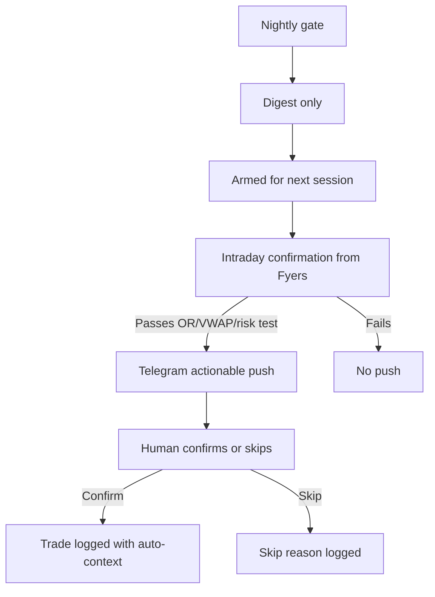
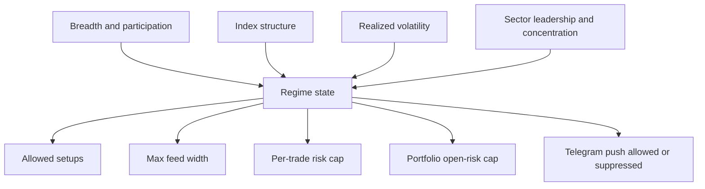
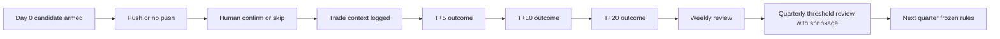

# Building a Genuine Edge in an NSE Swing-Trading Decision Tool

## Executive summary

Your current tool’s problem is not that it lacks indicators. It is that it still behaves like a screener when it should behave like a referee. Your own state document says the gate is not gating, a SELECTIVE day can still show roughly 80 cards, top scores saturate, contradictory opinions leak across screens, and the one compounding asset that free sites cannot copy — the journal→outcome→learnings loop — is still inert. fileciteturn0file1

Given your hard constraints, the highest-probability way to create real edge is a **deterministic cascade** rather than another additive score. The cascade should be: **regime gate → tradability gate → fresh-leg gate → catalyst/structure gate → risk gate → push-or-digest decision**. The trigger itself must be pass/fail and decomposed into named evidence. The only ranked number on-screen should be a **single posterior expectancy rank** for the exact rule-cell, not a black-box confidence score. That is the cleanest way to satisfy rules-first, one-metric-per-screen, and manual execution. fileciteturn0file1turn0file0

The strongest buildable edges from your actual data are also the ones your supplementary brief already surfaced: **under-covered earnings/order-win drift, 52-week-high nearness, sector-adjusted momentum, MAX or lottery exclusion, delivery% used as a normalized participation signal rather than raw fetish, and ASM-aware refusal.** The research base is strong: PEAD persists in India, 52-week-high nearness predicts future returns better than raw past returns, and residual or idiosyncratic momentum tends to keep more of momentum’s return while reducing crash exposure. citeturn25view0turn18view0turn27view0turn27view1

The practical conclusion is blunt. Do **not** spend the next cycle adding more chips, more patterns, or more confluence math. Build these in order: **hard refusal**, **tight risk math**, **regime enforcement downstream**, **Telegram armed-list workflow**, **disclosure ingestion**, and **the shrunken private learning loop**. Most of the rest is theatre. fileciteturn0file1turn0file0

| Priority | Change | Why it matters most | Buildability on your data | Theatre risk |
|---|---|---|---|---|
| Very high | Replace additive readiness with deterministic gate + one posterior expectancy rank | Solves saturation, contradiction, and “reskinned screener” disease at the root | Fully buildable from NSE OHLCV, delivery%, ChartsMaze screening/disclosure data, Fyers intraday fileciteturn0file1 | Low |
| Very high | Risk-refusal layer with stop-width, liquidity, circuit, ASM, and position-size constraints | Prevents the current nonsense of 20%+ stops and forces tradeability before alerting | Fully buildable fileciteturn0file1turn0file0 | Low |
| Very high | Telegram “armed list → actionable push” workflow | Converts the tool from dashboard to disciplined process without spam or chasing | Fully buildable; Fyers live/intraday already available, though pre-open coverage is unconfirmed fileciteturn0file1 | Low |
| High | PEAD/order-win drift module for under-covered names | Strongest structural edge in your stack if filtered hard enough | Buildable from ChartsMaze EPS/sales/disclosures + OHLCV/delivery citeturn25view0 | Low |
| High | Regime governor that actually changes feed width, size, stop caps, and allowed setup types | If regime only displays and does not govern, it is decoration | Buildable from your breadth, sector RS/RRG, and index OHLCV data fileciteturn0file1 | Low |
| High | Journal→outcome→learnings loop with shrinkage | The only real moat that compounds privately | Buildable now, but trustworthy only after enough observations fileciteturn0file1 | Low |
| Medium | Ingest insider/bulk-deal feeds already on disk | Adds underused informational context | Buildable after cleaning, because feeds already exist on disk but are mostly un-ingested fileciteturn0file1 | Medium |
| Low | Add more pattern chips, more confluence bonuses, or opaque AI ranking | Makes the app feel smarter while reducing actual discipline | Easy to build, hard to justify | Very high |

## Assumptions and design principles

A few assumptions matter because they constrain what is honest. Capital size is unspecified, so all risk recommendations are given as **risk-per-trade bands** rather than rupee amounts. The tool is **single-user, manual execution only, public data only**, and it currently has NSE daily OHLCV with delivery%, ChartsMaze RS/screeners/sector RS/RRG/ASM flags/growth/disclosure feeds, and Fyers live plus intraday candles. It does **not** have full balance-sheet fundamentals, consensus estimates, options data, or confirmed pre-open data from Fyers. Your current live database window is also short — roughly March 2025 through early July 2026 in the state document — so fine-grained optimization should be treated as sample-starved until you backfill more history. fileciteturn0file1

That means three design principles should be non-negotiable.

First, **the trigger cannot be a score**. A score can rank already-qualified names, but it cannot be the reason a name qualifies. This is also the right lesson to take from curated platforms such as MarketSmith or MarketSurge: the value is not “more indicators,” it is narrowing attention to a short actionable list and tying pattern recognition to current buy points and earnings context. citeturn22news0

Second, **one metric means one ranked number after the gate**, not before it. I recommend replacing readiness with **Posterior Expectancy Rank**. The formula is simple and explainable:

```text
Posterior Expectancy = shrink(cell_mean_T+10_R, parent_mean_T+10_R, n, k)
Rank = percentile rank of Posterior Expectancy among today's gate-passing names
```

Where a “cell” is coarse and human-readable, such as:

```text
setup_family × regime_state × sector_leadership × fresh_leg_status
```

The trigger is still deterministic. The rank exists only to order already-qualified names.

Third, **everything should be inspectable by a beginner**. Every alert must decompose into five visible blocks: **market regime, stock structure, participation, catalyst, risk math**. If the user cannot inspect each one, the tool is drifting back toward black-box theatre. That is especially important because your own state doc already says the current system gives conflicting opinions across pages, which is fatal for a judgment tool. fileciteturn0file1

## Entry engine and Telegram workflow

The right way to raise precision is not to add more confluence. It is to define **a very small number of setup families**, make each family mutually intelligible, and then **refuse anything that is extended, stale, illiquid, regime-misaligned, or hazard-flagged**. The literature supports exactly that direction: PEAD persists after controls in India, 52-week-high nearness outpredicts raw past returns, and residual/idiosyncratic momentum reduces time-varying factor exposure and crash risk compared with conventional momentum. citeturn25view0turn18view0turn27view0turn27view1

### What separates a 60% setup from a 40% setup

In this tool, a 60%+ setup should mean **all** of the following are true:

1. **Regime support**: market state allows the setup family at all.
2. **Fresh leg**: the stock is near the origin of a move, not 10 bars late.
3. **Stock-specific strength**: price strength remains strong after subtracting sector lift.
4. **Participation**: the move is being sponsored by volume/delivery, not just air pockets.
5. **Risk integrity**: the stop is valid and tight enough to size sanely.

A 40% setup is usually missing at least one of those. If it is missing two, or has any hazard flag, it should not be a push; often it should not even survive the feed.

### The deterministic entry cascade

Use this sequence, in order, with no additive rescue.

| Setup family | Specific rule | Exact fields used | Why it stays explainable | Validation design | Primary metric |
|---|---|---|---|---|---|
| **Earnings or order-win drift** | Require catalyst day or prior 3 sessions, positive QoQ and YoY EPS plus sales growth, gap acceptance, high participation, and no hazard flags | ChartsMaze `eps_qoq`, `eps_yoy`, `sales_qoq`, `sales_yoy`, `announcements`, `order_wins`, `episodic_pivot`, `asm_flag`, partial `market_cap`; NSE/Fyers OHLCV, delivery%, intraday 1m or 5m bars | User can inspect the exact disclosure, gap size, fill %, delivery spike, and stop location | Event study on catalyst dates; compare T+5/T+10/T+20 returns of qualified vs disqualified catalyst names | Precision at T+10, median T+10 return in R |
| **Fresh base breakout near the high** | Break above pivot from a 15–60 session base, `close/pivot <= 1.04`, `close/rolling_252_high >= 0.85`, and `distance_from_21EMA <= 6%` | Daily OHLCV, rolling 252-day high, pivot from screener/pattern logic, EMA10/21, sector RS | Beginner can see the base, pivot, 52-week high nearness, and extension instantly | Walk-forward breakout test with same-day and next-day entries | Hit rate to +2R before stop |
| **First constructive pullback** | Only after a qualifying breakout; first touch/reclaim of 10EMA or 21EMA within 3–15 trading days of the breakout, not below prior pivot | Daily OHLCV, EMA10/21, breakout timestamp, pivot, intraday reclaim from Fyers | It is either the first orderly pullback or it is not | Conditional test on post-breakout pullback bars | Avg winner/avg loser in R |
| **IPO first-stage base** | Listings with first non-chaotic base, still within stage-1 style structure, not extended from pivot, stop <= cap | First bhavcopy appearance date, OHLCV, EMA10/21, pivot logic, ChartsMaze IPO-base tags | Easy to visualize because listing age and first base are concrete | Bucket by listing age and base quality | Median MAE and T+10 expectancy |
| **Gap-acceptance opening-range continuation** | For armed names only: next-day gap is accepted if the stock holds above VWAP and above opening-range low after 09:15, with fill <= one-third by 09:30 or 09:45 | Official cash-market timing, Fyers intraday candles, VWAP, prior close, today open, opening range levels | The check is visible: did price hold or reject the gap? | Compare accepted vs rejected gaps on the armed list | Accepted-gap continuation rate |

The geometry behind these rules is not arbitrary. PEAD tells you to care about fresh public information and delayed diffusion. The 52-week-high paper tells you that **where the stock sits in its 12-month range** matters more than the usual obsession with raw past returns. Residual momentum tells you to prefer stock-specific strength over broad sector beta. citeturn25view0turn18view0turn27view0turn27view1

### Fresh-leg detection

The cleanest fresh-leg state machine is:

```text
FRESH_BREAKOUT
= breakout_age <= 7 bars
AND close <= pivot * 1.04
AND nearness_52w_high >= 0.85
AND extension_21 <= 0.06

FRESH_PULLBACK
= breakout_age between 3 and 15 bars
AND first_touch_of_10_or_21_ema = true
AND prior_pivot_not_lost = true
AND no hazard flags

STALE
= breakout_age > 15 bars
OR extension_21 > 0.08
OR close > pivot * 1.08
```

Exactly which fields compute those:

- `breakout_age`: derived from your own pivot or breakout event timestamp.
- `nearness_52w_high = close / rolling_max(high, 252)`.
- `extension_21 = close / EMA21 - 1`.
- `prior_pivot_not_lost`: close stays above pivot or pivot-zone low.
- `hazard flags`: ASM, circuit revision, MAX/lottery profile, low-liquidity, abnormal fade.

This is one of the biggest upgrades because it directly attacks the current failure mode of entering extended names that look “strong” only because they are late. Your own supplementary brief was right to treat 52-week-high nearness as both an entry-quality gate and an anti-chase gate. fileciteturn0file0turn0file1turn18view0

### Gap acceptance, gap rejection, and pre-open or opening-range behavior

The rule should be strict because next-day gap chasing is where manual swing traders donate edge.

The NSE cash-market schedule matters here: the regular pre-open runs from **09:00 to 09:08**, and normal market trading starts at **09:15**. Because your state doc says Fyers pre-open coverage is unconfirmed, the tool should **not** auto-trigger from pre-open prints. Use pre-open as context only; use the first 5-minute or 15-minute opening range as the first actionable confirmation window. citeturn11view1turn11view2turn11view3 fileciteturn0file1

A robust **acceptance** rule for an armed catalyst or breakout candidate is:

```text
gap_pct between +2% and +8%
AND first_15m_close > VWAP
AND first_15m_low >= opening_range_low
AND gap_fill_by_09_30 <= 33%
AND projected_RVOL >= 2.0
AND stop_pct <= regime_cap
```

A robust **rejection** rule is:

```text
gap_pct > +10%
OR price loses VWAP and OR low in first 15m
OR fill > 50% before 10:00
OR projected stop > allowed cap
```

This should be visible in plain English on the alert:

> “Gap accepted: +4.8%, first 15m held above VWAP, gap fill 18%, projected RVOL 2.3x, stop 4.9% below OR low.”

If the stock gaps and immediately fails the acceptance test, do **not** push a “buy dip” rescue alert. Put it into the digest later if it rebuilds.

### The Telegram engine

This is where deterministic logic should shine and AI should be demoted to an assistant.

The engine should have three states only:

**Digest-only**, **Armed**, and **Actionable Push**.

- **Digest-only** means the name passed nightly screens but is still missing timing confirmation.
- **Armed** means it passed all EOD gates and has a pre-committed trigger/stop plan for tomorrow.
- **Actionable Push** means intraday timing confirmation arrived and the risk math still holds.

That workflow is much closer to the way strong discretionary platforms curate “breaking out today” lists than the current “80 cards all look urgent” experience. citeturn22news0

| Telegram payload field | Why it must be present |
|---|---|
| Symbol and setup family | “EP drift”, “fresh breakout”, “first pullback”, “IPO base” keeps the language stable |
| Market regime and sector state | User sees immediately whether the market is helping or fighting |
| Exact trigger price and exact stop price | Prevents vague alerts |
| Stop distance in % and in ATR | Makes the risk visible |
| Max position size at 0.25%, 0.35%, 0.50%, and 0.75% capital risk | Lets the human confirm fast without separate calculator hops |
| Pivot / gap / OR level being used | Shows where the setup lives |
| Gap status and projected RVOL | Separates acceptance from chase |
| Delivery_z and sector-adjusted momentum snapshot | Keeps participation and stock-specific strength visible |
| Hazard strip | ASM, circuit revision, low turnover, MAX/lottery, surveillance, bulk-deal overhang |
| One-sentence rationale | AI can draft this, but it must be assembled from the fields above |

The **push vs digest** rule should be harsh:

- **Nightly digest**: maximum 5 names in RISK_ON, 3 in SELECTIVE, 1 in DEFENSIVE, 0 in NO_TRADE.
- **Intraday push**: maximum 1 push per symbol per day, and only for names already on the armed list.
- **No push** for a raw screener hit that was not armed the previous night, unless it is an exceptional same-day event-catalyst name with tight stop and no hazard flags.

The **human confirmation** flow should be part of the moat:



The AI role, if you want one, should be **narrative and labeling only**. It can summarize a disclosure, compress a long rationale, or classify a free-text skip reason into your mistake taxonomy. It should **never** be the firing mechanism. That keeps the engine rules-first while still making the interface smarter.

## Risk engine and loss containment

The state doc is right that a 27% stop on a swing card is not a “plan”; it is an abdication. Your system needs a new ethic: **if the stop cannot be both valid and sizeable, the trade does not qualify.** fileciteturn0file1

### Stop placement rules

Use a hierarchy, not a slogan.

| Stop type | Specific mechanism | Exact fields used | When valid | Refuse when | Metric to track |
|---|---|---|---|---|---|
| **Gap-day or opening-range low** | Initial stop just below gap-day low or confirmed OR low, whichever is structurally relevant | Fyers intraday bars, day low, OR low, VWAP, daily OHLCV | EP/order-win gaps, accepted gaps | Gap already filled deeply, OR too wide, or stop exceeds cap | Stop distance %, first-hour failure rate |
| **Pivot or swing structure stop** | Below pivot-zone low, breakout bar low, or last higher low | Daily OHLCV, pivot event, Fyers intraday if entering next day | Fresh base breakouts and IPO bases | Old breakout, sloppy base, huge zone width | +2R before stop rate |
| **ATR-structure hybrid** | `min(structure_low, entry - 1.2 × ATR20)` for liquid names | Daily ATR20, structure low | First pullbacks and liquid leaders | ATR explodes after news or widens stop beyond cap | Median MAE |
| **21EMA violation stop** | Close below 21EMA or decisive loss of 21EMA plus prior swing low | EMA21, daily close, swing structure | Mainly for trailing, and as initial stop only on orderly pullback entries | Initial breakout entry where EMA stop would be too wide | Trend retention vs give-back ratio |

My opinionated maximum acceptable **initial stop distance** for this tool:

- **RISK_ON**: default cap **6.0%**
- **SELECTIVE**: default cap **5.0%**
- **DEFENSIVE**: default cap **4.0%**
- **Exceptional EP/IPO cases**: up to **7.5%** only if liquidity, catalyst quality, and hazard filters all pass
- **Anything above 8%**: refuse outright

That single rule would already eliminate a huge amount of low-quality noise. It also forces you to solve the right problem: either the setup is fresh enough to define a small invalidation, or it is too late.

### Position sizing and portfolio heat

Position size should be trivial to audit:

```text
rupee_risk = capital × risk_per_trade
quantity = floor(rupee_risk / (entry - stop))
```

Then place **regime caps** on top:

| Regime | Base risk per trade | Hard max risk per trade | Portfolio open risk cap | Max new positions/day |
|---|---:|---:|---:|---:|
| RISK_ON | 0.50% | 0.75% only for top-ranked catalyst names | 2.0% | 2 |
| SELECTIVE | 0.35% | 0.50% | 1.25% | 1 |
| DEFENSIVE | 0.25% | 0.35% | 0.75% | 1 |
| NO_TRADE | 0% | 0% | 0% | 0 |

This turns regime from “display” into “law.”

Also add two portfolio refusal rules:

1. **Sector concentration**: no more than **35%** intended gross exposure in one sector.
2. **Correlated breakout stack**: if three names belong to the same industry cluster, size the second and third at half normal risk even in RISK_ON.

### India-specific hazards the tool should enforce

This is one of the clearest structural edges in your dataset, because free tools usually surface these names without protecting the user from what the flags imply.

The official NSE ASM page says the shortlisting criteria explicitly include **price variation, volume variation, volatility, market cap, delivery percentage, client concentration, unique PAN count, and P/E**, and the official NSE working paper finds that after inclusion in short-term ASM, **prices stabilize and traded volume reduces**. That is exactly why these names should be treated as surveillance-risk names, not normal momentum leaders. citeturn9view0turn20view0

So the tool should **refuse** to alert or log a new swing entry if any of these are true:

- ChartsMaze or ingested disclosure shows **ASM or GSM** status.
- Recent **circuit-revision** disclosure indicates heightened surveillance or unstable bands.
- The intended **stop distance exceeds the likely daily band trapping risk**.
- Median 20-day turnover is too low relative to intended position size.
- The stock has a **MAX/lottery profile** or serial circuit behavior without real informational catalyst.
- The name is in or near a **call auction / illiquid microstructure** context.
- The stock cannot offer at least **2R to the first decision point** before obvious overhead supply.

Also use the official timings operationally: block-deal windows exist early and mid-session, and abnormal post-deal price behavior is useful information. The official equity timetable shows block deal session 1 from **08:45 to 09:00** and session 2 from **14:05 to 14:20**. citeturn11view1

### Pyramiding

Only add if the first unit is already working.

The rule should be:

- Add only on **first constructive pullback** or **secondary breakout**.
- Never add if the initial position is below cost.
- Finance the add from **open profit**, not fresh optimism.
- Total portfolio risk after adding must still respect the regime cap.
- Never pyramid on a stock that has become extended beyond your fresh-leg thresholds.

That keeps the tool aligned with asymmetry instead of hope.

## Profit management and regime enforcement

You do not compound by predicting more winners. You compound by **keeping the good ones long enough and killing the bad ones cheaply enough**. Because raw momentum has known crash behavior and residual momentum exists largely to reduce that time-varying exposure, your profit rules should explicitly distinguish **initiation**, **trend**, and **extension**. citeturn27view0turn27view1

### Trailing and partials

A clean three-mode trailing system works best.

**Initiation mode**
- Active from entry until the trade reaches about **+2R** or survives **5 bars**.
- Use the original structure stop.
- Do **not** tighten too early.

**Trend mode**
- Switch once the stock proves itself.
- For faster catalyst names, trail on a **10EMA close** or prior swing low.
- For steadier leaders, use **21EMA + structure**.
- Exit on decisive close below the chosen trail plus a loss of prior swing character.

**Extension mode**
- Enter if the stock is climactic: for example `distance_from_21EMA > 8%`, or `distance_from_10EMA > 2 ATR20`, or after serial wide-range up bars.
- Book **25% to 33%** into strength.
- Tighten the trail on the remainder.

That directly implements the useful heuristic: **sell into weakness when a trend is still new; sell into strength when a trend is visibly extended.**

### Exit composites

Use a small composite, not a kitchen sink:

- Close below chosen trail average.
- High-volume downside reversal after extension.
- Two distribution days in five sessions for a late-stage leader.
- Break of the most recent higher low.
- Gap-down rejection after a mature move.
- Regime downgrade if the trade is not yet well in profit.

The card should show this as named evidence, not as an “exit score.”

### Regime must govern downstream

Your current regime page is analytically rich, but your own state document says it does not enforce discipline downstream. That must change. The regime should use what you already compute — breadth on the NIFTYMIDSML400 universe, participation ratios, sector leadership, and index structure — plus realized volatility from index OHLC, not options or VIX data you do not have. fileciteturn0file1

A workable regime table is:

| Regime | Definition using your data | Allowed setup families | Feed width | Risk cap | Exit posture |
|---|---|---|---:|---:|---|
| **RISK_ON** | Breadth strong and improving, indices above rising 21/50DMA, realized vol calm, sector leadership broad | Breakout, first pullback, EP drift, IPO stage-1 | 8 max | 0.50% base | Give leaders room, use trend mode |
| **SELECTIVE** | Mixed breadth or narrow leadership, indices okay but participation uneven | EP drift, first pullback in leaders, only best breakouts | 3 max | 0.35% base | Faster de-risking |
| **DEFENSIVE** | Breadth weak or deteriorating, realized vol elevated, leadership narrow and unstable | Exceptional catalyst only | 1 max | 0.25% base | Tight trails, partial faster |
| **NO_TRADE** | Breadth broken, index structure weak, realized vol unstable, leaders failing | None | 0 | 0 | Raise cash |

And crucially, the regime input should govern **all** of these:

- how many names appear in the feed,
- which setup families are allowed,
- max stop width,
- per-trade risk,
- max open risk,
- sector concentration,
- whether Telegram can send pushes at all.

That is the difference between regime as information and regime as enforcement.

The historical-analog layer should stay simple. Build a regime vector from your existing fields, such as:

```text
[breadth_20R, breadth_50R, breadth_4.5R, daily breadth delta, 
 index_above_21, index_above_50, realized_vol_percentile_20d, 
 sector_concentration_top2, sector_RS_dispersion]
```

Then find the nearest historical days in your own database and show:

- median Nifty T+5,
- median mid-smallcap T+5,
- median qualified-setup T+10 expectancy,
- avg stop-out rate.

This is explainable nearest-neighbor analog matching, not black-box classification. It uses only your own history.



## Market mechanics and structural edges

This is where India-specific reality can create and protect edge, provided you are selective enough.

### The real edges

Your own supplementary brief was directionally right: **the informational edge is in under-covered public disclosures and the defensive edge is in refusing structurally suspect names.** fileciteturn0file0

| Structural edge | Specific mechanism | Exact fields used | Why it is real | Quality metric |
|---|---|---|---|---|
| **PEAD and disclosure drift** | Buy only high-quality public-information shocks that continue to diffuse slowly | EPS/sales QoQ/YoY growth, order-win / announcement / episodic-pivot feeds, gap behavior, delivery_z, market-cap proxy | PEAD remains statistically significant in India, and underreaction is strongest where information diffuses slowly citeturn25view0 | T+10 precision and expectancy |
| **Delivery% as normalized participation** | Use `delivery_z`, not raw delivery%; high delivery on constructive price bars is sponsorship, high delivery on failed breakouts is distribution | NSE delivery%, OHLCV, delivery rolling mean/std or MAD | Delivery% is even part of ASM’s objective surveillance parameters, so it clearly matters, but it matters conditionally, not in isolation citeturn9view0 | Post-breakout follow-through rate |
| **ASM/GSM and circuit-awareness** | Treat surveillance and band changes as hazard filters, not decoration | ChartsMaze ASM flags, circuit-revision disclosures, price-band or surveillance actions | NSE and SEBI explicitly use these mechanisms to control suspicious price/volume behavior, and official study evidence shows post-inclusion stabilization and volume reduction citeturn9view0turn20view0 | Hazard-filter false positive rate |
| **Insider and bulk-deal footprints** | Use cluster buying and price-hold-above-deal-price as a context boost, not a standalone trigger | ChartsMaze insider feed, bulk-deal feed, block-deal disclosures, price vs deal price | Academic evidence favors clustered, high-conviction insider buying, especially in smaller companies; but price confirmation matters citeturn26view0 | T+20 excess return vs matched controls |
| **Pump-signature exclusion** | Refuse lottery-like names and operator-style circuits | MAX1/20, MAX5/60, circuit hits, market-cap proxy, turnover, gap-fade behavior, ASM transitions, delivery_z | This is exclusion alpha: free sites surface the fireworks; your edge is refusing them fileciteturn0file0 | Excluded-names underperformance vs qualified names |

### Information-driven versus operator-driven circuits

A practical distinction you can make with your data:

**Information-driven circuit candidate**
- New earnings or order-win disclosure.
- Positive QoQ and YoY growth.
- Gap/circuit holds without deep fill.
- Delivery_z elevated.
- Price stabilizes above disclosure day midpoint after the first circuit burst.

**Operator-driven circuit candidate**
- No meaningful disclosure.
- Small market-cap proxy and thin turnover.
- Serial upper circuits or extreme MAX profile.
- Large upper shadows or repeated deep intraday fades once liquidity appears.
- Later surveillance or circuit revisions.

Because official ASM criteria explicitly track abnormal price/volume behavior, delivery, concentration, and market cap, the presence of those signatures should make the tool more suspicious, not more excited. citeturn9view0turn20view0

### What is mostly theatre

This needs to be said plainly.

- **Raw confluence count** is theatre if it can be “rescued” by enough chips.
- **Generic VCP / tight / momentum / shakeout labels** are theatre unless tied to fresh-leg, regime, and risk integrity.
- **Raw RS ranks** are theatre if sector beta is doing the work; use sector-adjusted momentum instead. Residual-style momentum research exists precisely because conventional momentum’s factor loading and crash risk are real. citeturn27view0turn27view1
- **RRG dashboards** are theatre if they do not suppress or permit setups downstream.
- **LLM confidence** is theatre in your context.
- **Pre-open prediction games** are theatre if your actual actionable trigger only becomes reliable after 09:15.

## Feedback loop and prioritized roadmap

The private loop should become the moat, but only if it is designed to be statistically humble.

Your current doc already identifies the journal as the one uncopyable asset, and also confirms it is still basically a manual stub. Fixing that is not “nice to have”; it is the compounding layer that eventually makes the rest defensible. fileciteturn0file1

### How the loop should work

Every candidate should become an observation, not just every trade.

For **each armed setup**, store:

- rule family,
- regime state,
- sector state,
- trigger, stop, stop %,
- gap data,
- delivery_z,
- residual or sector-adjusted momentum,
- hazard flags,
- whether it was pushed,
- whether the user confirmed or skipped,
- skip reason,
- if taken, actual fill and qty.

Then auto-backfill:

- T+5, T+10, T+20 close-to-close returns,
- max favorable excursion and max adverse excursion in R,
- whether it reached +1R, +2R, +3R before stop,
- time to stop or time to +2R,
- exit reason,
- slippage.

That gives you four crucial comparison sets:

1. **Filtered-out names**  
2. **Armed but skipped names**  
3. **Pushed and taken names**  
4. **Pushed but skipped names**

Without all four, you cannot tell whether the gate is good, whether the human is improving, or whether the tool is only flattering hindsight.

### How to avoid overfitting

The safest design is **hierarchical shrinkage**, not cell-hunting.

Use this order:

- Global baseline for each setup family.
- Then setup family × regime.
- Then add one more split only if the cell is large enough, such as sector leadership or fresh-leg status.
- Do **not** optimize more than one threshold in any quarter.
- Freeze thresholds for the next quarter after updating.
- Record every threshold change and evaluate it only out of sample.

A practical shrinkage rule is:

```text
posterior_cell_mean = (n / (n + k)) * cell_mean + (k / (n + k)) * parent_mean
```

With `k` around 20 to 30 for hit rate, and higher for expectancy in R.

### Minimum sample sizes before trusting output

Because your current point-in-time history in the live tool is still short, I would trust outputs only in stages:

| Observation count in a broad cell | What you may trust | What you must not do |
|---:|---|---|
| `< 20` | Descriptive notes only | No rank, no rule changes |
| `20–39` | Rough directionality | No threshold changes |
| `40–74` | Coarse setup-family comparison | No cell splitting beyond regime |
| `75–149` | Setup-family × regime ranking with shrinkage | Change thresholds at most quarterly |
| `150+` and spanning at least two distinct market states | Use posterior expectancy rank operationally | Still avoid fine-grained feature mining |

That means the honest answer today is: **your feedback loop can start immediately, but its outputs should initially be advisory rather than rule-changing.** With the history currently described in the state document, you should strongly prefer coarser cells and more backfill before trusting any “optimized” threshold. fileciteturn0file1



### The buildable roadmap

This is the roadmap I would actually follow.

| Rank | Build item | Exact output | Validation gate before trusting | Why it moves the edge |
|---|---|---|---|---|
| Top | **Deterministic gate rewrite** | Regime gate, tradability gate, fresh-leg gate, catalyst gate, risk gate, one posterior expectancy rank | Feed width compresses materially; precision improves vs current readiness baseline | Converts reskinned screener into opinion engine |
| Top | **Risk-refusal layer** | Stop cap, liquidity cap, hazard refusal, position sizing, portfolio heat | Reduction in average stop size; fewer trapped or unsizeable alerts | Prevents large, stupid losses |
| Top | **Telegram armed-list workflow** | Nightly digest, intraday actionable push, confirm/skip with logging | Push-to-confirm ratio, low spam, higher precision than digest | Makes the tool executable |
| High | **Disclosure ingestion** | Order-win, insider, bulk-deal, circuit-revision, announcement tables | Event-study uplift vs non-catalyst setups | Unlocks real informational edges already sitting on disk |
| High | **PEAD/order-win rule family** | Catalyst-led drift setup family with hard filters | T+10 expectancy > ordinary breakout family | Best edge density in your data |
| High | **Regime downstream enforcement** | Setup suppression, risk caps, feed-width caps, push suppression | Large spread in expectancy between allowed vs suppressed states | Turns regime from display into law |
| High | **Journal loop** | Auto-context logging, T+5/10/20, mistake taxonomy, weekly review | Enough observations for coarse posterior ranking | Creates the private moat |
| Medium | **Sector-adjusted momentum tiebreak** | Stock return minus sector return over chosen horizon | Better out-of-sample ranking than raw RS | Keeps sector beta from fooling the feed |
| Medium | **Pump-signature exclusion** | MAX/lottery/circuit/ASM composite refusal | Excluded bucket underperforms materially | Cheap exclusion alpha |
| Medium | **Profit engine** | Trailing mode, partial logic, drawdown controls | More MFE captured with same or lower drawdown | Converts raw edge into compounding |
| Do not build now | More confluence chips, more technical labels, opaque AI trigger, extra scores | Noise | None | Mostly theatre |

The main correction to your earlier supplementary brief is this: although adding additional public sources such as official FII/DII flow might be interesting, your final hard constraint says the thesis must use only the listed available data. So the right move is not to widen the data perimeter first. It is to **exploit the data you already have more ruthlessly** — especially the disclosure feeds already on disk, the delivery%, the breadth/sector structure you already compute, and the Fyers intraday confirmation layer you already possess. fileciteturn0file0turn0file1

The sharpest single sentence I can give you is this:

**Your edge will not come from seeing more names. It will come from refusing almost everything, alerting only when structure + catalyst + participation + regime + risk all align, and then learning from every taken and skipped decision until your one ranked number becomes a private, explainable posterior of what actually works for you.** fileciteturn0file1turn0file0turn25view0turn18view0turn27view1