# Manas OS — Chart-First Rebuild Proposal

**Status:** Architecture proposal, not an implementation claim  
**Date:** 2026-08-03  
**Decision:** Rebuild Manas OS around an AI chart reviewer that is the primary setup-perception and ranking authority. Preserve deterministic code for data truth, tradability, risk arithmetic, audit, and delivery—not for deciding what a chart “looks like.”  
**Risks:** A chart-capable model can sound expert while being temporally wrong, inconsistent across model versions, or blind to missing market context. The design below makes those failures visible and measurable; it does not assume that adding a vision LLM creates edge.

## 1. Actual goal

Build a complete, point-in-time swing-trading operating system that can:

1. understand the current market and identify which setup families deserve attention;
2. retrieve a broad but tractable queue of liquid, relevant stocks;
3. inspect weekly and daily charts in the style of an experienced discretionary trader;
4. recognize and locate VCPs, fast-zone reversals, breakouts, strong starts, pocket pivots, constructive pullbacks, and related setup phases;
5. rank only the best *actionable now* charts, while being allowed to return zero;
6. convert a selected chart into an explicit entry, invalidation, and risk plan;
7. deliver timely, explainable signals and manage open positions;
8. learn from every shown, rejected, armed, taken, and missed setup without look-ahead leakage.

The product is not a stock screener with an LLM commentary layer. It is a closed decision-and-learning loop whose most important learned component is chart perception.

## 2. Why the current authority must be replaced

The repository's own later evidence supersedes the earlier confidence in the gate/council design:

- The 2026-07-30 audit found 12.1% recall on 331 stocks that gained at least 10% over 10 sessions, despite showing 139–281 names per night.
- The rank was inverted/noisy: the top decile returned -1.43% and the bottom 25 returned -1.21% in the measured sample.
- The later pre-registered edge test returned **NO EDGE** for the late gate: refused names outperformed passed names, while the upstream discovery pool itself showed positive separation from random.
- The current code lets weighted model votes create a chair TAKE/SKIP; vision then sees only the chair's TAKE finalists and can merely promote, demote, veto, or hold them. A bad upstream decision therefore prevents the chart model from ever seeing the best chart.
- The signal path sends only sizer-approved chair TAKEs. The failure is therefore structural, not merely a weak prompt or unattractive UI.

Certain: the current rank/cascade/council must cease to be the recommendation authority.  
Likely: the discovery substrate contains useful information because the measured discovery pool separated from random in the supplied test.  
Unverified: any proposed AI chart reviewer has forward trading edge until it passes the promotion protocol in section 15.

## 3. Product doctrine

### 3.1 The authority split

| Responsibility | Owner in the rebuilt system | Why |
|---|---|---|
| Price, volume, corporate-action, identity, freshness, and point-in-time truth | Deterministic data layer | These are factual invariants. |
| Broad candidate retrieval | Transparent numerical retrieval | It should maximize useful recall and cost control, not pretend to recognize the finished setup. |
| Setup recognition, phase, contractions, chart quality, and visual ranking | Chart AI | This is the discretionary visual task the user wants modeled. |
| Market breadth, MBI/XP, leadership, theme heat, and Smart Money context | Context engine, consumed by Chart AI | Context changes which charts and setup phases matter. |
| Entry/invalidation proposal | Chart AI proposes landmarks; deterministic code snaps them to exact bars and validates arithmetic | Perception selects the landmark; code prevents numerical hallucination. |
| Position size, portfolio heat, account limits, and order arithmetic | Existing risk engine, after separate authorization for any numeric changes | Money math must be reproducible and cannot vary by model. |
| Alert wording and decision card | Structured renderer over stored evidence | Same evidence must produce the same actionable card. |
| Broker execution | Manual confirmation initially | No autonomous execution until the full loop proves operational and predictive reliability. |

The key rule is: **AI owns visual judgment; code owns facts and constraints.** Deterministic detectors may provide retrieval hints, measurements, and disagreement evidence, but may not veto a chart because it failed a brittle pattern formula.

### 3.2 Zero is a valid answer

The system must never manufacture “top picks.” It publishes one of:

- **ACT NOW** — trigger is present or next-session executable;
- **READY** — constructive and close to a defined trigger;
- **DEVELOPING** — worth monitoring, not yet ready;
- **REJECT** — attractive at first glance but structurally defective;
- **ABSTAIN** — insufficient/stale/conflicting evidence;
- **NO QUALIFIED SETUPS** — valid nightly outcome.

This replaces saturated grades and forced top-N lists.

## 4. Target end-to-end architecture

```mermaid
flowchart LR
    A["Point-in-time market data"] --> B["Integrity and freshness"]
    B --> C["Broad candidate retrieval"]
    C --> D["Deterministic chart-pack renderer"]
    A --> E["Market context engine"]
    E --> F["Context brief"]
    D --> G["Chart AI reviewer"]
    F --> G
    H["Versioned playbooks and exemplars"] --> G
    G --> I["Structured observations and landmarks"]
    I --> J["Fact and risk validator"]
    J --> K["AI-ranked chart queue"]
    K --> L["Human arm or reject"]
    L --> M["Alerts and position workflow"]
    M --> N["Decision and outcome ledger"]
    N --> O["Evaluation, calibration, and failure memory"]
    O --> H
```



Every box must carry an `as_of` timestamp, data version, renderer version, model ID, prompt/playbook version, and run ID. A result without this lineage is not eligible for evaluation or signaling.

## 5. Preserve: the parts of Manas already worth keeping

The companion [feature inventory](../features_listed.md) records the wider audit. The following are load-bearing assets, not rewrite candidates.

### 5.1 Market home and context

- Preserve the v5 round-4 visual language and the active Market Home structure.
- Preserve the breadth layout, including regime history and breadth analytics/drilldowns.
- Preserve MBI/XP as separate, visible context rather than collapsing them into an unexplained scalar.
- Preserve index candles, sector/industry views, opportunity density, and data-freshness disclosures.
- Preserve the focus-theme and theme-pulse substrate, but rebuild taxonomy/source quality where the task board already identifies gaps.

### 5.2 Smart Money / institutional footprint

- Preserve `alpha_activity_signals` as the canonical activity-score source.
- Preserve `footprint_daily`, per-symbol history, campaign balance, delivery weighting, and the five Flow Board lanes: silent accumulation, absorption, public markup, retail churn, and silent offloading.
- Preserve the UI statement already embedded in the component: the score says **where to look**, not how much to buy or whether to buy.
- Recalibrate or label assumption-based thresholds before treating lane names as validated facts. In particular, several constants in `scanner/footprint.py` are explicitly marked as assumptions pending replay calibration.
- Move the Flow Board from being buried after the shortlist into the market-context/discovery experience, where it can influence which charts receive attention.

### 5.3 Operational and learning substrate

- Preserve the EOD ingestion/pipeline registry, stage logging, durable job manifests, events/SSE, cancellation/retry, coverage, readiness, and freshness maps.
- Preserve point-in-time prices, NSE indices, delivery/activity inputs, disclosures/deals, fundamentals, earnings calendar, identity mapping, and provider status.
- Preserve ChartDrawer, weekly/daily chart rendering, volume, RS/secondary panes, AVWAP, and explicit trade landmarks; standardize them for model input rather than drawing ad hoc screenshots.
- Preserve journal trades, candidate outcomes, decision/refusal/near-miss ledgers, track record, lessons, expectancy research, and alpha experiment/model registries.
- Preserve the position workflow, coach, portfolio-heat infrastructure, manual Telegram workflow, transactional outbox, retry semantics, and kill switch.
- Preserve guided flow, mentor/guru checklists, trader profile, beginner/expert density, and data-degradation banners where they continue to support the new workflow.

## 6. Retire, rebuild, and quarantine

### 6.1 Retire as recommendation authority

- The fail-fast deterministic setup cascade and its late gate.
- Additive or ordinal composite score as the source of “best” charts.
- Weighted multi-LLM TAKE/SKIP voting and the chair majority as final selection.
- The current vision ordering that reviews only chair TAKE finalists.
- Forced top picks and grades that imply edge unsupported by forward outcomes.
- Any rule that silently discards a chart solely because a deterministic VCP/pocket-pivot/fast-zone definition did not fire.

These modules may remain temporarily to create baselines, retrieval features, and counterfactual comparisons. Their output must be labeled **legacy baseline**, never recommendation.

### 6.2 Rebuild

- Candidate generation into high-recall retrieval rather than a restrictive qualification funnel.
- The agents package into one principal chart-review contract plus optional challengers, not a council of loosely prompted personas.
- Chart rendering into immutable multi-timeframe chart packs.
- Signals into evidence-backed setup cards with precise trigger state and expiry.
- The navigation around the user's actual nightly and intraday decisions.
- Edge testing around all exposed decisions, including “not shown” and “model abstained.”

### 6.3 Quarantine until separately validated

- HMM/HAR regime models, RF/LightGBM direction or breakout models, analogues, alpha memory, advisor prose, and experimental predictors.
- ChartsMaze-derived fields when authentication or freshness is degraded.
- Setup expectancy values produced from old, changing candidate definitions.
- The frozen PB-1/The One Setup protocol as a research baseline; do not silently turn it into live authority or change its money rules.

Quarantined features can appear in Edge Lab. They cannot affect live rank until a registered experiment passes promotion.

## 7. Candidate retrieval: broad, cheap, and non-destructive

Retrieval should answer “which charts are worth paying to inspect?” rather than “which stocks qualify as trades?”

### 7.1 Retrieval universe

Start from point-in-time tradable Indian equities and apply only hard factual exclusions:

- wrong instrument/series;
- missing or stale price/volume data;
- corporate-action discontinuity not normalized;
- untradable price/liquidity under the user's existing approved constraints;
- known event/data conditions that make an executable plan impossible.

Do not use pattern rules as hard exclusions.

### 7.2 Retrieval features

Use multiple lanes whose union becomes the nightly chart queue:

- relative strength and distance from meaningful highs;
- earnings/price acceleration and recent strong starts;
- unusual activity, delivery, disclosures/deals, and footprint lanes;
- leading sectors, industries, and themes;
- compression/volatility contraction measurements as hints;
- breakout proximity, gaps, volume expansion, pocket-pivot-like activity as hints;
- existing watchlist/focus list and developing setups;
- controlled exploration/random liquid names for measurement.

Each lane gets a visible reason. Retrieval can use numerical ranking for budget allocation, but that rank is not the final opportunity rank.

### 7.3 Review-budget allocator

Use a two-pass system:

1. a cheap pass over the full universe to produce a diverse, high-recall queue;
2. an expensive chart-AI pass over the allocated queue.

Reserve review capacity across setup families, sectors/themes, new leaders, developing watchlist names, and a random control sample. This avoids letting one popular feature monopolize the queue and preserves the ability to estimate missed-opportunity rates.

## 8. The immutable chart pack

The model should never inspect arbitrary browser screenshots. For every symbol/date, generate a deterministic package:

### 8.1 Images

- weekly chart covering the full base and prior advance;
- daily chart at a medium horizon for setup structure;
- daily zoom for the current trigger/fast zone;
- volume aligned to price with consistent scale and color semantics;
- RS line versus the chosen index and, where useful, sector;
- optional intraday panel only for setup families that require it;
- sector/theme and benchmark thumbnails for relational context.

All charts use a fixed template, resolution, candle count, padding, indicators, split adjustment, and “as of” cutoff. Future bars are impossible to render.

### 8.2 Exact data sidecar

Send a compact structured sidecar alongside the images:

- OHLCV rows for relevant landmarks;
- moving averages, ADR/ATR, relative volume, delivery/activity score and footprint campaign;
- distance from high, RS measurements, liquidity facts, earnings/event dates;
- breadth/MBI/XP context and sector/theme state;
- known data-quality flags.

The model must cite bar dates and visible landmarks. A validator resolves those references against the sidecar. This dual image-plus-data design prevents a pure vision model from inventing exact prices while retaining discretionary visual interpretation.

## 9. The Chart AI contract

### 9.1 One reviewer, structured output

The production interface should be a schema, not free prose. Each review returns:

```json
{
  "symbol": "EXAMPLE",
  "as_of": "YYYY-MM-DD",
  "setup_family": "VCP | FAST_ZONE_REVERSAL | BREAKOUT | STRONG_START | POCKET_PIVOT | PULLBACK | OTHER | NONE",
  "stage": "BASE_BUILDING | READY | TRIGGERING | EXTENDED | FAILED | UNCLEAR",
  "quality": 0.0,
  "actionability": "ACT_NOW | READY | DEVELOPING | REJECT | ABSTAIN",
  "landmarks": [{"name": "pivot", "date": "YYYY-MM-DD", "price": 0.0}],
  "contractions": [{"start": "YYYY-MM-DD", "end": "YYYY-MM-DD", "depth_pct": 0.0}],
  "evidence": [{"claim": "...", "chart": "daily", "date_span": ["...", "..."]}],
  "objections": [{"claim": "...", "severity": "LOW | MEDIUM | HIGH"}],
  "trigger": {"condition": "...", "price": 0.0, "expiry": "..."},
  "invalidation_landmark": {"date": "YYYY-MM-DD", "price": 0.0, "reason": "..."},
  "context_fit": {"market": "...", "theme": "...", "leader_status": "..."},
  "uncertainty": ["..."],
  "playbook_version": "...",
  "model_id": "..."
}
```

The model must be allowed to emit `NONE` and `ABSTAIN`. The `quality` field is calibrated per setup family; it is not treated as a universal truth until calibration is demonstrated.

### 9.2 Visual vocabulary

Build a versioned ontology that captures how the user and chosen practitioners actually read charts:

- trend/stage and prior advance;
- base location, duration, depth, and symmetry;
- contraction sequence and volume dry-up;
- pivot quality, tightness, and overhead supply;
- shakeout, undercut/reclaim, and fast-zone reversal behavior;
- breakout participation and close quality;
- pocket-pivot context rather than a single formula;
- strong-start origin, first pause, and continuation quality;
- relative strength before price, sector/theme leadership, and leader versus laggard behavior;
- extension, late-stage failure, wedging, churning, and distribution objections.

Do not reduce these concepts to one rigid detector. Store definitions, positive examples, hard negatives, near misses, and pairwise “A is better than B” examples.

### 9.3 Separate perception from edge

Two evaluations are required:

1. **Playbook fidelity:** Did the model locate the same structure, phase, and landmarks as the expert label?
2. **Forward utility:** Did the ranked/actionable output improve executable forward outcomes versus baselines?

A model can imitate the language of Bonde, Qullamaggie, or O'Neil and still have no forward edge. It is not promoted on stylistic agreement alone.

## 10. Market context engine

The chart reviewer receives a short, computed context brief—not the whole database and not a vague LLM summary.

### 10.1 Preserve and combine without hiding components

- MBI and XP remain visible inputs with their individual histories.
- Breadth includes participation, highs/lows, above-moving-average families where valid, and divergence flags.
- Regime is described as evidence, not allowed to veto an otherwise excellent chart automatically.
- Sector/industry/theme leadership includes breadth, RS, acceleration, and recent follow-through.
- Smart Money includes activity score, tier, streak, delivery band, footprint lane, campaign balance, and net silent flow.
- Leader follow-through measures whether recent breakouts/strong starts are holding, failing, or expanding.
- Event context includes earnings and known disclosures/catalysts with freshness/source labels.

### 10.2 Setup routing by tape

The context engine proposes a nightly **attention policy**, such as:

- breakout/continuation setups favored in broadening leadership;
- fast-zone reversals and tight pullbacks favored in selective or repairing tape;
- fewer/no new longs when leadership is failing and breadth is deteriorating;
- themes promoted only when multiple liquid leaders confirm, not from a single narrative.

This policy changes review allocation and provides context to the Chart AI. It does not force a trade or block discovery.

## 11. Model strategy and Kronos decision

### 11.1 Start with a strong multimodal model, not Kronos

Kronos is not required for the first rebuild. Its time-series representation may later become a retrieval feature, embedding, or challenger, but it does not solve the central requirement: expert-like multi-timeframe visual interpretation with grounded landmarks and market context.

The first production experiment should use a capable multimodal model behind the structured Chart AI contract. Model choice remains replaceable through the existing model registry and experiment infrastructure.

### 11.2 Do not average different model “perceptions”

Use one champion reviewer per registered version. Run challengers in shadow and compare:

- fidelity to expert labels;
- stability under equivalent chart renders;
- abstention/calibration;
- forward ranking utility;
- cost and latency.

Do not restore a majority-vote council. If models disagree, store the disagreement as research evidence; the champion remains deterministic for that version.

### 11.3 When to train an open-source model

Training becomes justified only after Manas owns a high-quality dataset generated by real review work:

- point-in-time chart packs;
- expert setup/phase/landmark annotations;
- hard negatives and near misses;
- pairwise ranking preferences;
- decisions and forward outcomes;
- immutable train/validation/test time splits.

The likely progression is:

1. prompt and schema evaluation with a hosted multimodal champion;
2. local embedding/classification or reranking experiments;
3. parameter-efficient fine-tuning of a vision-language student on cloud GPUs;
4. distillation only if the student preserves fidelity and forward utility.

The user's Ryzen 9 5950X and RTX 3060 12 GB are suitable for local development, chart generation, quantized inference on smaller models, embeddings, and lightweight heads. They are not the sensible target for full training of a competitive vision-language model. Rent a GPU instance only when the labeled dataset and registered experiment justify it.

## 12. Rebuilt user experience

Keep the v5 round-4 design system, but organize the product around decisions rather than internal modules.

### 12.1 TODAY — “What kind of market is this?”

- MBI/XP and breadth layout at the top;
- leadership follow-through and failure rate;
- hot sectors/themes with evidence and source freshness;
- Smart Money Flow Board;
- setup attention policy for tonight;
- system/data/model health as a compact status strip;
- explicit “no qualified setups” state.

### 12.2 CHART QUEUE — “What deserves my eyes?”

- ACT NOW, READY, DEVELOPING, REJECT/ABSTAIN lanes;
- weekly/daily chart thumbnails and AI annotations;
- setup family, phase, pivot, invalidation landmark, context fit, evidence, objections, and uncertainty;
- retrieval reason versus final AI judgment shown separately;
- pairwise comparison mode: “which chart is better and why?”;
- human actions: arm, watch, reject, correct label, open full chart.

This replaces SCANNERS + SHORTLIST + DEBATE as three competing representations of nearly the same nightly funnel.

### 12.3 TRADE PLAN — “Can I execute this safely?”

- exact validated trigger, invalidation, entry window, and expiry;
- unchanged approved risk/sizing engine and portfolio heat;
- event/data caveats and do-not-trade conditions;
- model evidence beside exact numerical facts;
- manual arm/skip with a reason.

### 12.4 POSITIONS — “Has the thesis changed?”

- preserve current position cards, R path, thesis, freshness, and coach workflow;
- compare live behavior to the original chart landmarks and expected setup path;
- flag failure/extension/distribution as observations, never silently rewrite the original thesis;
- preserve Telegram mirror and manual controls.

### 12.5 JOURNAL & EDGE LAB — “Is the system learning?”

- decision ledger, trade journal, equity/R views, and lessons;
- model/setup/regime calibration and forward cohort results;
- missed-winner review, false-positive review, and human/model disagreement;
- champion/challenger experiments, lineage, failure memories, drift, and costs;
- legacy gate/council as benchmark only.

ALPHA LAB becomes EDGE LAB: every experiment must connect to a live decision field and an evaluation dataset.

## 13. Storage and API changes

Add versioned, append-only records rather than overloading `agent_verdicts`.

### 13.1 New core entities

- `chart_packs`: symbol, as-of time, image/object hashes, renderer version, data cutoff, quality flags;
- `context_briefs`: as-of time, component values, attention policy, source/freshness lineage;
- `chart_reviews`: model/prompt/playbook versions, structured review, raw response hash, validation status, cost/latency;
- `chart_landmarks`: normalized dated points/ranges resolved against price data;
- `chart_rankings`: queue and pairwise ranks scoped to a registered run;
- `review_decisions`: shown/armed/watched/rejected/corrected with actor and reason;
- `signal_cards`: immutable published payload, state, expiry, and delivery outcome;
- `label_sets`: expert annotations, adjudication status, and provenance;
- `evaluation_runs`: frozen cohort, baselines, metrics, result, and promotion decision.

Keep the current outcomes, journal, jobs, model registry, experiment, outbox, and pipeline tables where their semantics already fit.

### 13.2 API boundaries

Introduce explicit resources:

- `POST /api/chart-runs` and `GET /api/chart-runs/{id}`;
- `GET /api/chart-queue?as_of=`;
- `GET /api/charts/{symbol}/pack?as_of=`;
- `GET /api/charts/{symbol}/review?as_of=`;
- `POST /api/charts/{symbol}/decision`;
- `POST /api/charts/{symbol}/correction`;
- `POST /api/signal-cards/{id}/arm|skip`;
- `GET /api/edge/evaluations` and registered experiment detail.

Use the existing durable job/events system for long-running model calls. Do not add another scheduler or streaming protocol.

## 14. Alerts and execution

### 14.1 Signal state machine

Use explicit transitions:

`DEVELOPING → READY → ARMED → TRIGGERED → ENTERED | EXPIRED | INVALIDATED | SKIPPED`

Every transition is timestamped and tied to the original review version. A rerun can publish a new review; it cannot mutate the old thesis.

### 14.2 Alert payload

Each alert contains:

- symbol, setup family, and phase;
- thumbnail/link to annotated weekly and daily charts;
- exact trigger and invalidation;
- why now, top evidence, strongest objection, market/theme context;
- freshness/model/playbook version;
- manual ARM/SKIP controls;
- expiry and “manual execution only” notice.

Reuse the transactional Telegram outbox, retry semantics, reply capture, and kill switch. Keep live sending disabled during shadow mode.

### 14.3 Intraday role

Intraday data should monitor only already-READY/ARMED names for trigger and invalidation. It must not continuously hallucinate fresh setups across the full universe. This constrains cost, noise, and accidental look-ahead.

## 15. Evaluation and promotion protocol

The rebuild succeeds only if it improves decision quality forward in time.

### 15.1 Frozen evaluation unit

For every nightly run, freeze:

- the eligible universe and retrieval lanes;
- all chart packs and context brief;
- the champion review/rank and abstentions;
- legacy-gate, simple momentum/RS, and random-liquid baselines;
- which names were shown to the user;
- the next-session executable entry rules and costs already approved by the project.

Never backfill a newer model's decision into an old live cohort and call it forward evidence. Historical replay is research, separately labeled.

### 15.2 Metrics

Measure by setup family, actionability, regime, sector/theme state, and rank bucket:

- recall of future leaders from the eligible universe;
- precision and base-rate lift for ACT NOW and READY;
- rank separation and pairwise accuracy;
- executable R/return distributions, drawdown, and adverse excursion;
- calibration of setup quality/actionability;
- abstention utility and no-trade nights;
- stability under chart-render perturbations;
- missed winners, false positives, and data/model failure rates;
- cost and latency per useful reviewed chart.

Use date-clustered uncertainty/block bootstrap so many stocks from one tape do not masquerade as independent evidence.

### 15.3 Promotion gates

A challenger becomes champion only when all are true:

1. point-in-time integrity and lineage checks pass;
2. playbook fidelity improves or remains acceptable;
3. forward ranking/decision utility beats declared baselines with uncertainty shown;
4. performance is not explained by one date, sector, or setup family;
5. abstention and failure behavior are operationally safe;
6. the user signs off on changed behavior before any live alert authority changes.

No metric is selected after seeing results. Register the cohort, outcome window, and metric before starting.

## 16. Implementation sequence and done-tests

### Phase 0 — Stop false authority and freeze evidence

- Relabel current top picks, chair verdicts, grades, and late-gate results as legacy baseline.
- Preserve all current data; do not delete history.
- Freeze versions of candidate code, chart renderer, prompts, outcomes, and evaluation definitions.
- Add an architecture decision record for the new authority split.

**Done when:** no current UI or Telegram path presents the failed gate/council output as validated edge, and historical comparisons remain reproducible.

### Phase 1 — Chart-pack and label foundation

- Build immutable weekly/daily/zoom chart packs and exact data sidecars.
- Add annotation/correction UI and setup ontology v1.
- Seed examples from the user's accepted/rejected charts and repository outcome history.
- Create hard-negative and pairwise-review workflows.

**Done when:** a reviewer can label structure, phase, landmarks, objections, and better/worse pairs without future data, and the same input hashes reproduce.

### Phase 2 — Chart AI in shadow

- Implement the structured reviewer with one champion multimodal model.
- Review broad retrieval queues before any legacy gate.
- Validate landmark dates/prices; expose uncertainty and failures.
- Store costs, latency, prompt/model versions, and raw hashes.

**Done when:** nightly shadow runs complete reliably and every review is inspectable, reproducible, and schema-valid.

### Phase 3 — Context fusion and rebuilt Chart Queue

- Build context briefs from MBI/XP, breadth, leadership, themes, footprint, and events.
- Replace SCANNERS/SHORTLIST/DEBATE with the AI-ranked Chart Queue.
- Add ACT NOW/READY/DEVELOPING/REJECT/ABSTAIN and zero-pick behavior.

**Done when:** each rank explains retrieval reason, visual judgment, context fit, objection, trigger, invalidation, and uncertainty without hiding component data.

### Phase 4 — Forward evaluation and manual signals

- Start pre-registered forward cohorts with legacy, simple, and random baselines.
- Wire eligible READY/ACT NOW cards to the preserved risk engine.
- Run Telegram in dry/shadow mode, then manual ARM/SKIP only after operational checks.

**Done when:** signal state, expiry, delivery, and outcome capture are complete and promotion evidence is available—not when a demo alert sends.

### Phase 5 — Position loop and continuous learning

- Compare post-entry behavior to original landmarks/thesis.
- Capture user corrections, misses, false positives, and disagreement.
- Build failure-review queues and periodic calibration reports.

**Done when:** every recommendation has a terminal outcome or explicit unresolved state, and corrections become versioned training/evaluation data.

### Phase 6 — Optional local/open-source student

- Select a suitable vision-language base only after dataset audit.
- Train/rerank with time-split labels and pairwise preferences on rented GPUs as required.
- Run as challenger; promote only through the same protocol.

**Done when:** the student matches the champion's fidelity and forward utility at a useful cost/latency—not merely when fine-tuning finishes.

## 17. First vertical slice

Do not rebuild every setup at once. Build the complete loop for a small, representative ontology:

1. **VCP/base contraction and breakout readiness** — tests multi-timeframe structure and contraction reasoning;
2. **Fast-zone reversal/undercut-reclaim** — tests phase and landmark recognition;
3. **Strong start plus first constructive pause** — tests theme/leader context and continuation;
4. **Pocket pivot** — retained as a research family because it was the only tentatively positive historical setup in the 2026-07-30 audit, while explicitly marked PRE-M3/unverified forward.

The slice still includes retrieval, chart packs, context, review, queue, manual decision, alert shadow, and outcomes. Breadth of workflow matters more than breadth of pattern vocabulary.

## 18. Non-goals and protected constraints

- No autonomous order placement in the initial rebuild.
- No new or altered capital, risk, stop, size, R:R, or exposure numbers in this proposal.
- No promise that an LLM or open-source model has edge before forward validation.
- No deletion of historical decisions, refusals, or outcomes.
- No wholesale UI redesign outside the frozen v5 round-4 language; the information architecture changes, the visual source of truth remains.
- No dependency on Kronos.
- No dependence on private practitioner wording or copyrighted material as hidden model knowledge; playbooks must be represented by permitted summaries, user-authored labels, and owned examples.

## 19. Acceptance criteria for the rebuilt primary driver

The Chart AI is strong enough to become the primary Manas driver only when:

- it sees the broad queue before legacy pattern gates;
- it receives immutable weekly/daily charts plus exact point-in-time facts and market context;
- it locates dated evidence and landmarks that code can validate;
- it distinguishes setup family from phase and actionability;
- it can reject and abstain, including an entire no-trade night;
- its outputs are stable enough to reproduce by registered version;
- expert corrections and hard negatives are captured as owned data;
- its rank demonstrates forward separation from simple and legacy baselines;
- alerts and plans use only validated facts and approved deterministic risk arithmetic;
- model/data degradation suppresses authority visibly instead of silently falling back to fabricated confidence.

## 20. Evidence map used for this proposal

- `design/EDGE_FINDINGS_2026-07-30.md` — recall, rank, grade saturation, preliminary setup evidence.
- `design/EDGE_TEST_PREREGISTRATION_2026-07-31.md` and `design/EDGE_TEST_RESULTS_2026-07-31.md` — frozen late-gate test and NO EDGE result.
- `cli/__init__.py`, `scheduled_update.py`, `jobs.py`, and `api/app.py` — current pipeline, job, and API substrate.
- `agents/debate.py`, `agents/chair.py`, `agents/vision.py`, `agents/sizer.py`, and `agents/signals.py` — current recommendation and alert authority path.
- `alpha/activity.py`, `scanner/footprint.py`, and `desk/src/components/v5/FlowBoard.jsx` — canonical activity/Smart Money implementation and UI doctrine.
- `desk/src/App.jsx`, active tab components, `ChartDrawer.jsx`, and `desk/src/api.js` — currently wired product surface.
- `TASKS.md`, `design/STATE_OF_TOOL.md`, `design/FINAL_RECONCILIATION.md`, `design/BUILT_BUT_UNWIRED_AUDIT.md`, `design/LEARNINGS.md`, and the active schema — implemented, partial, stale, and pending capabilities.
- `design/bakeoff/round4/debate_merged_light.html` and v5 tokens — frozen design source of truth.

## Final recommendation

Proceed with this chart-first rebuild and skip Kronos for now. The highest-value investment is not training a model immediately; it is creating the immutable chart-pack, expert-label, pairwise-preference, and forward-evaluation loop that makes any model—hosted or open source—measurably better at *your* swing-trading decisions. Preserve Manas's market breadth, MBI/XP, Smart Money, data operations, risk, journal, and delivery moat, but remove the failed gate/council from authority before building on top of it.
